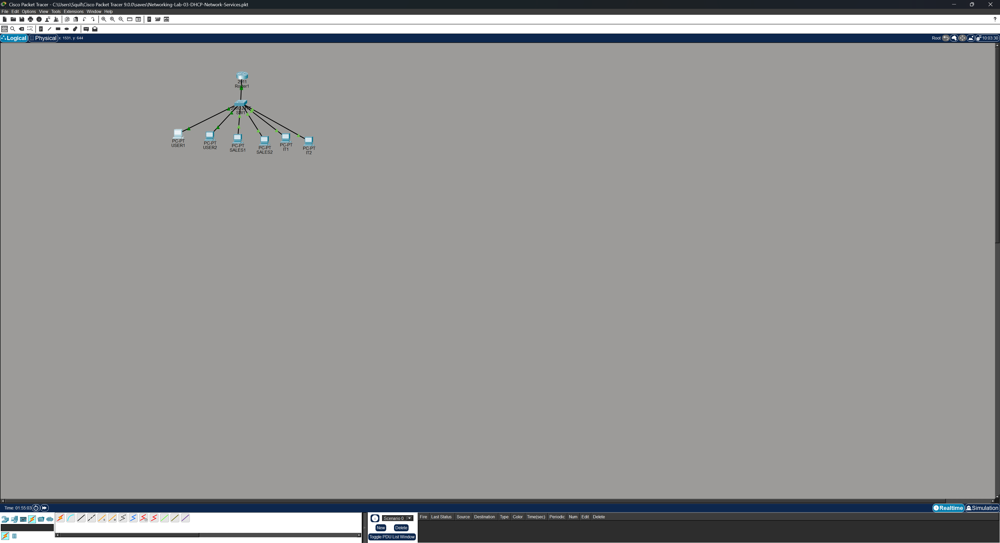
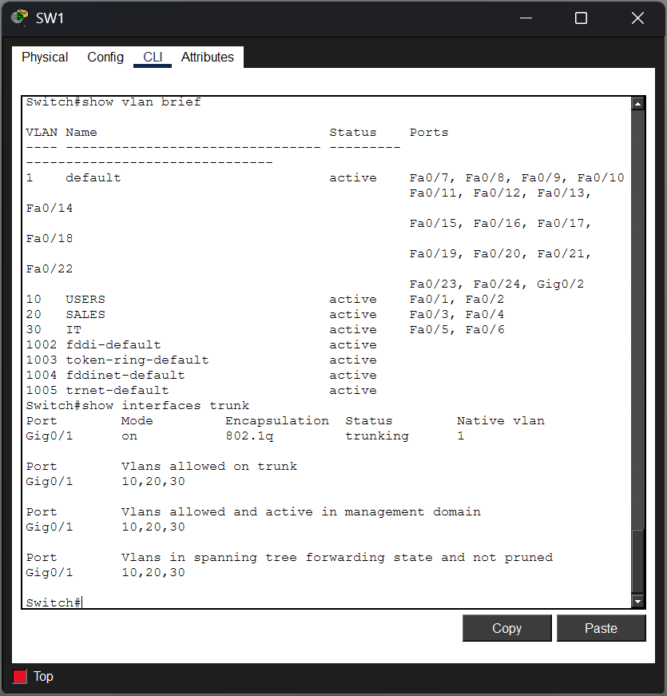
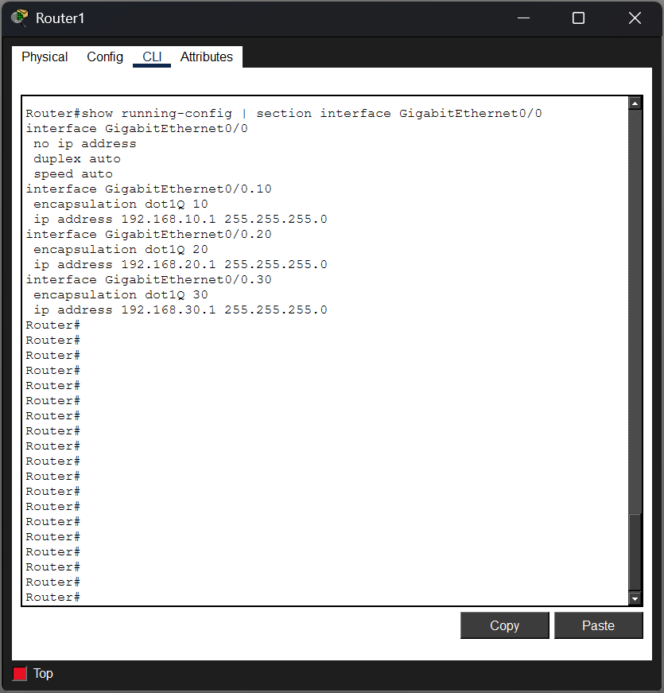
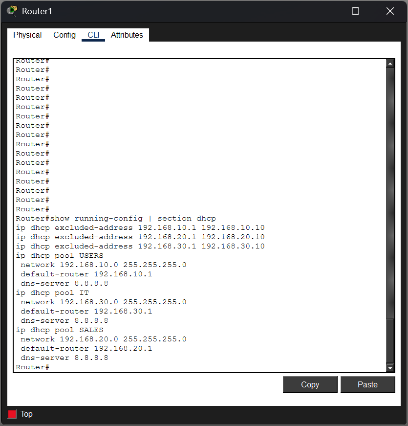
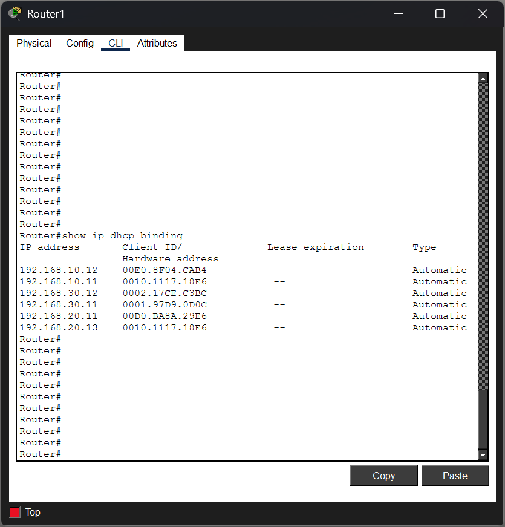
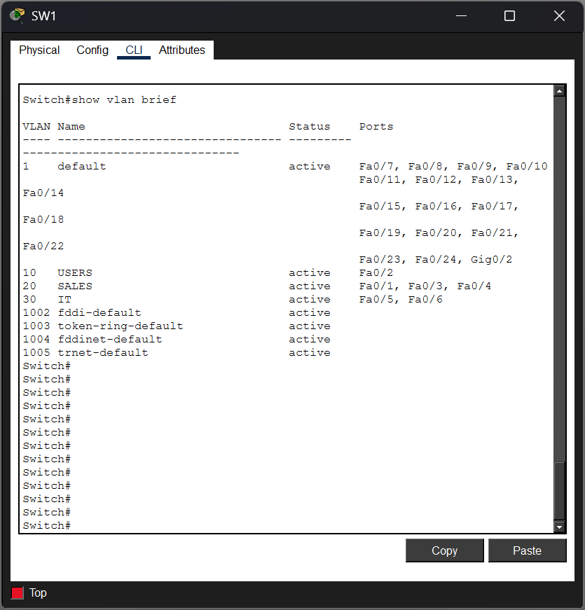

# Networking Lab #3 — DHCP & Network Services

## Overview

This lab demonstrates the deployment and troubleshooting of DHCP services across multiple VLANs in a Cisco Packet Tracer environment.

The network uses VLAN segmentation to separate Users, Sales, and IT devices. A Cisco router provides both inter-VLAN routing through router-on-a-stick and DHCP services for each subnet.

The lab also includes several troubleshooting scenarios involving DHCP configuration, trunking, and incorrect VLAN assignments.

## Network Topology

The environment consists of:

- 1 Cisco 2911 Router (R1)
- 1 Cisco 2960 Switch (SW1)
- 6 client PCs
- 3 VLANs
- 802.1Q trunking
- Router-on-a-stick inter-VLAN routing
- Centralized DHCP services



## VLAN and Addressing Scheme

| VLAN | Name | Network | Default Gateway | Client Ports |
|---|---|---|---|---|
| 10 | USERS | 192.168.10.0/24 | 192.168.10.1 | Fa0/1 - Fa0/2 |
| 20 | SALES | 192.168.20.0/24 | 192.168.20.1 | Fa0/3 - Fa0/4 |
| 30 | IT | 192.168.30.0/24 | 192.168.30.1 | Fa0/5 - Fa0/6 |

SW1 uses GigabitEthernet0/1 as an 802.1Q trunk carrying VLANs 10, 20, and 30 to R1.



## Router-on-a-Stick Configuration

R1 uses subinterfaces on GigabitEthernet0/0 to provide a default gateway for each VLAN.

```text
interface GigabitEthernet0/0.10
 encapsulation dot1Q 10
 ip address 192.168.10.1 255.255.255.0

interface GigabitEthernet0/0.20
 encapsulation dot1Q 20
 ip address 192.168.20.1 255.255.255.0

interface GigabitEthernet0/0.30
 encapsulation dot1Q 30
 ip address 192.168.30.1 255.255.255.0
```

This allows traffic to be routed between the three VLANs while maintaining separate Layer 2 broadcast domains.



## DHCP Configuration

R1 acts as the DHCP server for all three VLANs.

Addresses `.1` through `.10` are excluded from each DHCP scope so they can be reserved for infrastructure devices or other systems requiring predictable static addresses.

```text
ip dhcp excluded-address 192.168.10.1 192.168.10.10
ip dhcp excluded-address 192.168.20.1 192.168.20.10
ip dhcp excluded-address 192.168.30.1 192.168.30.10

ip dhcp pool USERS
 network 192.168.10.0 255.255.255.0
 default-router 192.168.10.1
 dns-server 8.8.8.8

ip dhcp pool SALES
 network 192.168.20.0 255.255.255.0
 default-router 192.168.20.1
 dns-server 8.8.8.8

ip dhcp pool IT
 network 192.168.30.0 255.255.255.0
 default-router 192.168.30.1
 dns-server 8.8.8.8
```



## DHCP Verification

Client devices were configured to obtain their IPv4 addressing dynamically.

DHCP operation was verified using commands such as:

```text
show ip dhcp binding
show running-config | section dhcp
ipconfig
```

Clients successfully received addresses from the DHCP scope associated with their VLAN, along with the appropriate subnet mask, default gateway, and configured DNS server.



## Troubleshooting Scenarios

### Ticket #003 — SALES Client Unable to Obtain DHCP Address

**Symptom:**  
A SALES client failed to receive a valid IPv4 configuration and received an APIPA address.

**Investigation:**

The client configuration was checked with:

```text
ipconfig
```

The router's DHCP configuration and bindings were then inspected.

**Root Cause:**  
The SALES DHCP pool had been configured for `192.168.200.0/24` instead of the correct `192.168.20.0/24` network.

**Resolution:**  
The incorrect DHCP pool was removed and recreated using the correct SALES network and default gateway.

**Verification:**  
The client successfully obtained a valid `192.168.20.x` address after renewing its DHCP configuration.

---

### Ticket #004 — IT Client Unable to Reach DHCP Server

**Symptom:**  
An IT client failed to receive an IPv4 address through DHCP.

**Investigation:**

VLAN existence and access-port assignments were checked using:

```text
show vlan brief
```

The trunk was then inspected using:

```text
show interfaces trunk
```

**Root Cause:**  
VLAN 30 had been removed from the trunk's allowed VLAN list.

**Resolution:**  
VLAN 30 was restored to the trunk.

**Verification:**  
The IT client successfully obtained an address from the `192.168.30.0/24` DHCP scope.

---

### Ticket #005 — USER Client Receives Address From Wrong Subnet

**Symptom:**  
A USER client received a valid DHCP address, but it belonged to the SALES subnet.

Expected:

```text
192.168.10.x
```

Received:

```text
192.168.20.x
```

**Investigation:**

The client's configuration was first checked with:

```text
ipconfig
```

Because the client was receiving a valid address from the wrong subnet, the switch VLAN configuration was inspected:

```text
show vlan brief
```

**Root Cause:**  
The USER access port had been incorrectly assigned to VLAN 20 instead of VLAN 10.

**Resolution:**  
The affected switch port was reassigned to VLAN 10 and the client's DHCP configuration was renewed.

**Verification:**  
The client successfully returned to the `192.168.10.0/24` network.



## Key Troubleshooting Commands

```text
show ip interface brief
show vlan brief
show interfaces trunk
show running-config
show running-config | section dhcp
show ip dhcp binding
ipconfig
ping
```

A key troubleshooting distinction reinforced during this lab was:

- `show vlan brief` verifies VLAN existence and access-port membership.
- `show interfaces trunk` verifies which VLANs are actually being carried across a trunk.

## Skills Demonstrated

- DHCP server configuration
- DHCP scopes and address exclusions
- Dynamic IPv4 addressing
- VLAN creation and segmentation
- Access-port configuration
- 802.1Q trunking
- Router-on-a-stick
- Inter-VLAN routing
- DHCP client verification
- APIPA troubleshooting
- VLAN troubleshooting
- Trunk troubleshooting
- Cisco IOS verification commands
- Structured network troubleshooting
- Cisco Packet Tracer

## Troubleshooting Methodology

The troubleshooting exercises followed a structured process:

1. Identify the reported symptom.
2. Verify the client's current network configuration.
3. Determine where expected network behavior stops.
4. Gather evidence using Cisco IOS verification commands.
5. Identify the root cause.
6. Make the smallest necessary configuration change.
7. Renew or retest the affected client.
8. Verify normal operation.

## Project Files

- `Networking-Lab-03-DHCP-Network-Services.pkt`
- `screenshots/`

## Key Takeaway

This lab demonstrated that DHCP problems are not always caused by the DHCP server itself. A client can fail to obtain an address because of an incorrect DHCP scope, a trunk configuration issue, or incorrect VLAN membership.

Effective troubleshooting requires verifying the endpoint, Layer 2 configuration, trunking, Layer 3 configuration, and DHCP services rather than immediately assuming one component is responsible.
